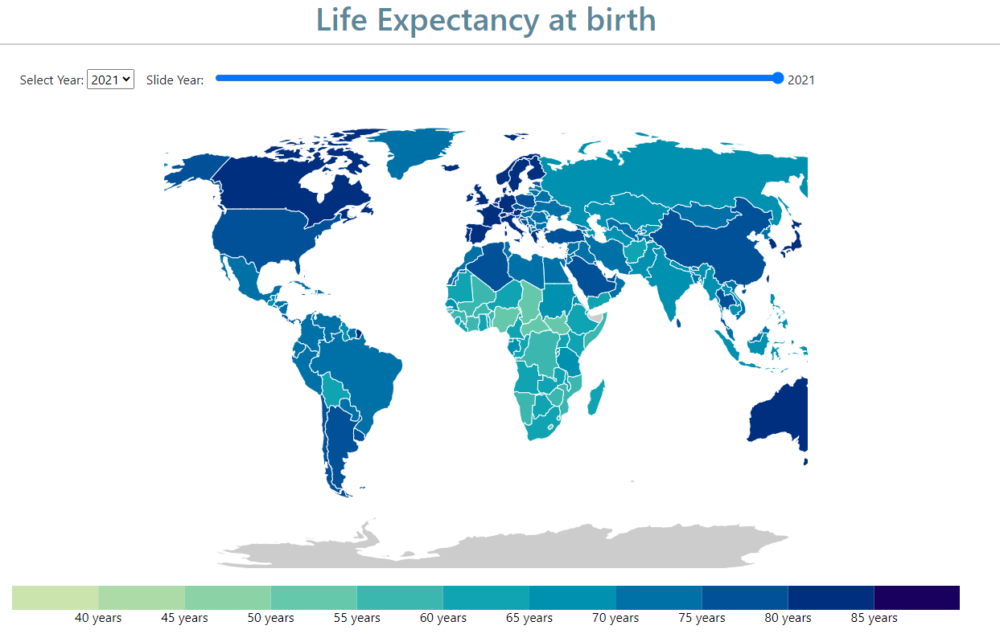
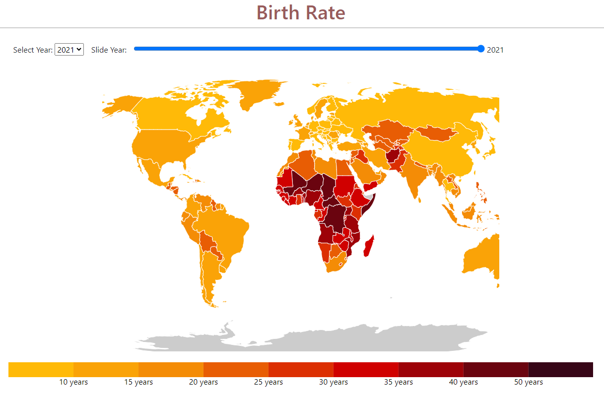
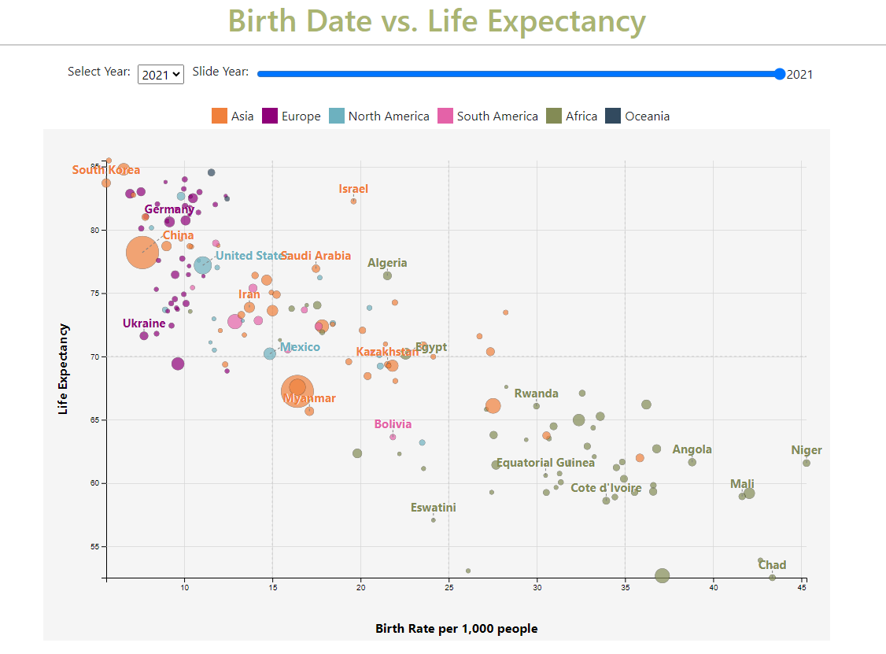

# LifeLines Report

## Purpose
Life expectancy and birth rates are two fundamental indicators of societal health and development. This project, LifeLines, was born out of a personal and empathetic desire to understand and visualize these critical metrics. Growing up in a region where healthcare and life expectancy are pressing issues, I have witnessed firsthand the profound impact these factors have on communities and families. I chose this topic because of its direct relevance to public health, economic stability, and overall societal well-being. Understanding these metrics can help in identifying areas that need urgent attention, developing policies that can improve public health, and ultimately, saving lives. According to the World Health Organization ([WHO](https://www.who.int/news/item/04-04-2019-uneven-access-to-health-services-drives-life-expectancy-gaps-who)), there are substantial disparities in life expectancy and birth rates globally. In high-income countries, life expectancy can exceed 80 years, while in low-income countries, it may be below 60 years. Additionally, birth rates also vary significantly, with some countries experiencing as high as 40 births per 1,000 people, while others have rates as low as 7 births per 1,000 people​ ([WHO](https://www.who.int/news/item/04-04-2019-uneven-access-to-health-services-drives-life-expectancy-gaps-who)).

## Target User Group
Public Health Officials are a specific subset of policy makers who focus on the practical application of health data to improve community health outcomes. Their primary goal is to use data on life expectancy and birth rates to design and implement public health interventions that target the specific needs of their populations. This role is critical in ensuring that health strategies are effectively addressing the most pressing health issues within communities.

### Importance of Data for Public Health Officials

Public health officials rely on accurate data on life expectancy and birth rates to make informed decisions that enhance community health. This data is critical for:

1. **Monitoring Health Trends**: Tracking life expectancy and birth rates helps identify health disparities and at-risk populations.
2. **Program Planning and Evaluation**: Data-driven insights guide the development, implementation, and assessment of public health programs, ensuring they address the most pressing health issues.
3. **Emergency Response**: During health crises, such as pandemics, officials use this data to allocate resources efficiently and mitigate health impacts.

### Example Usage

In a region with high birth rates and low life expectancy, public health officials can use the data to pinpoint underlying causes, such as limited access to prenatal care or high rates of infectious diseases. They might implement initiatives like prenatal education, vaccination campaigns, and nutritional support programs. By continuously monitoring these efforts, officials can adapt strategies to improve health outcomes.

### Stakeholder Interactions

Public health officials collaborate with local governments, healthcare providers, non-profits, and community groups. These partnerships are vital for collecting comprehensive data, sharing resources, and ensuring that health interventions are culturally appropriate and effective.

For instance, a public health official might partner with hospitals to gather birth rate data and work with community leaders to understand cultural barriers to healthcare. This collaborative approach helps design interventions that are both effective and community-approved.

## Key Problem: Lack of Accessible Data Visualization Tools

**Relevance to Users**

Public health officials, policymakers, and researchers need efficient tools to interpret life expectancy and birth rate data. Without these tools, making informed decisions becomes challenging, impacting public health strategies and outcomes.

**Why This Problem Was Chosen**

Interpreting raw data is a common issue among users, significantly affecting decision-making processes. Addressing this problem can streamline public health initiatives and resource allocation.

**User Problem Description**

1. **Interpreting Raw Data**:
   - **Problem**: Difficulty in understanding raw data.
   - **Impact**: Time-consuming, error-prone analysis delays decision-making.
   - **Solution**: Interactive visualizations enable quick comprehension of data trends.

2. **Identifying Health Disparities**:
   - **Problem**: Hard to detect regions with health disparities using raw data.
   - **Impact**: Inefficient targeting of public health efforts.
   - **Solution**: Choropleth maps visually highlight areas with low life expectancy and high birth rates.

3. **Evaluating Programs and Policies**:
   - **Problem**: Assessing effectiveness is tough with raw data.
   - **Impact**: Inability to identify successful strategies.
   - **Solution**: Bubble charts allow comparison of life expectancy and birth rate data over time.

4. **Engaging the Public**:
   - **Problem**: Raw data fails to engage and inform the public effectively.
   - **Impact**: Low public support for health initiatives.
   - **Solution**: Visual data presentations enhance public awareness and support.

By focusing on these issues, the LifeLines project aims to provide tools for better decision-making, efficient public health interventions, and improved health outcomes.

## Tools and Frameworks Used
- **D3.js**: The primary tool behind the dynamic and interactive choropleth maps and bubble charts.
- **Express.js**: Handles the server-side functionality for the LifeLines application.
- **Docker**: Creates a consistent and isolated development environment.
- **JavaScript**: Adds interactivity and dynamic behavior to web pages.
- **HTML/CSS**: The backbone of the application's structure and styling.
- **Python**: Used briefly to sanitize and filter the data before visualization.
- **CSV Data**: Stores and manages the life expectancy and birth rate data.

## Reflection and Next Steps
The journey of developing the LifeLines project has been a valuable learning experience, yielding significant insights into data visualization and web development. Using D3.js had a steep learning curve but proved to be effective for creating dynamic and responsive visualizations.

### Areas for Improvement
- **Data Preparation**: Data sanitization could have been streamlined further. While Python was used effectively, integrating data cleaning steps more seamlessly into the workflow would have saved time.
- **User Interface**: The UI could be enhanced to provide a better user experience and more responsive design. Custom styling, intuitive navigation, and improved interactivity would significantly improve the overall user experience.

### Next Steps
- **Automated Data Updated**: Implement scripts to regularly fetch and update life expectancy and birth rate data to keep the visualizations current.
- **Adding New Data**: Expand the dataset to include additional metrics such as health expenditure, education levels, and GDP. Create new visualizations to provide deeper insights and correlations between these variables and life expectancy.
- **Filtering and Comparing Data**: Introduce features that allow users to filter data by different criteria (e.g. region) and compare multiple datasets side by side to identify trends and correlations.

  ## Final Product Examples
  
  
  
